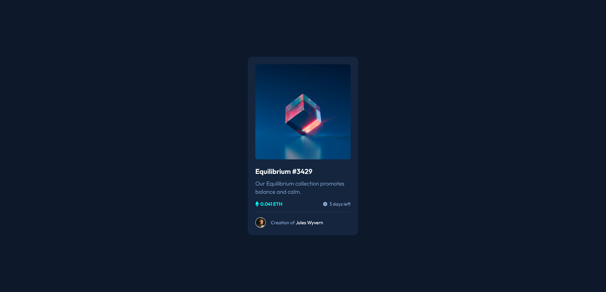

# Frontend Mentor - NFT preview card component solution

This is a solution to the [NFT preview card component challenge on Frontend Mentor](https://www.frontendmentor.io/challenges/nft-preview-card-component-SbdUL_w0U). Frontend Mentor challenges help you improve your coding skills by building realistic projects.

### Screenshot

### Links

- [Soulution](https://www.frontendmentor.io/solutions/nft-preview-card-component-sass-bem-grid-fluid-sizing-custom-props-MapEMaTuXR)
- [Live Site](https://bjoerndeppisch-fem-nft-preview-card.netlify.app/)

### Built with

- Semantic HTML5 markup
- CSS Custom Properties
- Pseudo-Elements
- Grid
- Sass
- BEM
- Fluid Sizing
- Vite

### Tools

- [Clamp Calculator for linear scaling](https://royalfig.github.io/fluid-typography-calculator/) [Viewport Range: 375px - 1440px]

## Author

- Frontend Mentor - [@bjoerndeppisch](https://www.frontendmentor.io/profile/bjoerndeppisch)
- Twitter - [@bjoerndeppisch](https://twitter.com/bjoerndeppisch)
